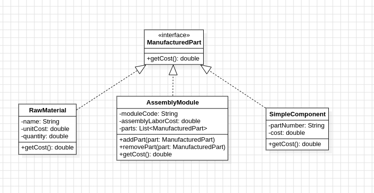

# LP5_Composite

Neste projeto, utilizamos o padrão Composite para montar um sistema de partes manufaturadas que permite composição entre peças, de modo que hajam peças simples autocontidas e peças compostas contendo outras.

## Diagrama de Classe

